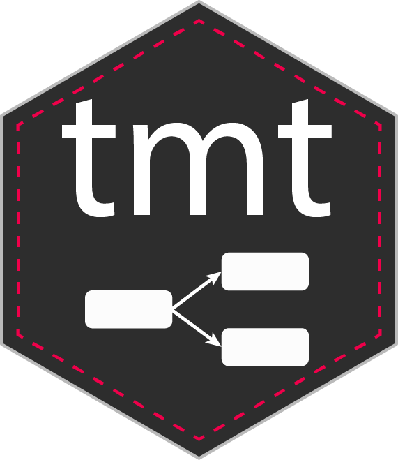

```{r internal, echo = FALSE}
knitr::opts_chunk$set(
  collapse = TRUE,
  comment = "#>",
  fig.path = "man/figures/"
)

  p <- utils::packageDescription("tmt")
```
# tmt 

<!-- README.md is generated from README.Rmd-->
[](https://app.travis-ci.com/jansteinfeld/tmt)
[](https://app.codecov.io/gh/jansteinfeld/tmt)
[](https://opensource.org/licenses/GPL-3.0/)
[](https://github.com/jansteinfeld/tmt/commits)
[](https://github.com/jansteinfeld/tmt/)
[](https://github.com/jansteinfeld/tmt/pulls)
[](https://github.com/jansteinfeld/tmt/issues)
[](https://github.com/jansteinfeld/tmt)
[](https://cran.r-project.org/package=tmt)
[](https://cran.r-project.org/web/checks/check_results_tmt.html)
[](https://cran.r-project.org/package=tmt)

The *tmt* Package provides conditional maximum likelihood (CML) item parameter estimation of sequential as well as cumulative deterministic multistage (MST) designs (Zwitser & Maris, 2015, [<10.1007/s11336-013-9369-6>](https://doi.org/10.1007/s11336-013-9369-6)) as well as probabilistic sequential and cumulative multistage designs (Steinfeld & Robitzsch, 2021, [<10.31234/osf.io/ew27f>](https://doi.org/10.31234/osf.io/ew27f)). Supports CML item parameter estimation of conventional linear designs and additional functions for the likelihood ratio test (Andersen, 1973, [<10.1007/BF02291180>](https://doi.org/10.1007/BF02291180)) as well as functions for the simulation of several kinds of multistage designs. 


## Installation
To install the latest (development) version of the *tmt* package, please copy the following commands in your R console:

```{r installation, eval = FALSE}
# Install release version from CRAN
install.packages("tmt")
# Install development version from GitHub
devtools::install_github("jansteinfeld/tmt")
```

## Usage
The application of the package *tmt* is illustrated below. Further, examples of different MST designs can be found in the associated vignette of the package.
For the application of the package and the CML method, it is necessary first to specify the MST design. For this purpose, a model language was developed, which is illustrated in the first section of the example. First, each module of the design must be specified. The following deterministic sequential MST design consists of six modules, four paths' and three stages. In the first part, the modules of the MST designs are defined (basically the allocation of items). Here different methods are available, the user can apply either the R function *paste*, but also address the items manually by hand as vector. It is important that the names of the specified items in the modules match those in the data. For the application illustration, some data is subsequently simulated on the basis of the specified MST design. In this example, a seed was set so that the results are easier to compare and to follow this example. For the actual estimation of the item parameters, the function *tmt_rm* is available. If data has been created with the *tmt_sim* function, it would be enough to hand over the data generated with this function as part of the export is also the MST design. If the data has not been synthetically generated with this function, it is necessary to specify the MST design.

You will find a detailed description of the package in the vignette (like sequential cumulative as well as probabilistic MST designs). 


```{r usage}
library(tmt)

# spezification of the mst design
mstdesign <- "
    M1 =~ paste0('i',1:5)
    M2 =~ c(i6, i7, i8, i9, i10)
    M3 =~ c(i11, i12, i13, i14, i15)
    M4 =~ c(i16, i17, i18, i19, i20)
    M5 =~ c(i21, i22, i23, i24, i25)
    M6 =~ c(i26, i27, i28, i29, i30)

    # define branches
    p1 := M4(0,2) + M2(0,2) + M1(0,5)
    p2 := M4(0,2) + M2(3,5) + M3(0,5)
    p3 := M4(3,5) + M5(0,2) + M3(0,5)
    p4 := M4(3,5) + M5(3,5) + M6(0,5)
  "

# application of the simulation function to generate som synthetic data
  items <- seq(-2,2,length.out=30)
  names(items) <- paste0("i",1:30)
  
  dat_mst <- tmt_sim(mstdesign = mstdesign,
        items = items,
        persons = 500,
        seed = 1111)

# estimate the item parameters
mod1 <- tmt_rm(dat_mst, mstdesign = mstdesign)


summary(mod1)
```

### Outlook
The following features are planned for future releases:

* the partial credit model for multistage designs
* missing values in multistage designs
* improving the speed of the package
* plots of the multistage design

## References
* Glas, C. A. W. (1988). The Rasch Model and Multistage Testing. *Journal of Educational Statistics*, 13(1), 45. doi: 10.2307/1164950
* Steinfeld, J., & Robitzsch, A. (2021). Conditional maximum likelihood estimation in probability-branched multistage designs. *PsyArXiv*. 20 March 2021. doi: 10.31234/osf.io/ew27f
* Zwitser, R. J., & Maris, G. (2013). Conditional statistical inference with multistage testing designs. *Psychometrika*, 80(1), 65–84. doi: 10.1007/s11336-013-9369-6